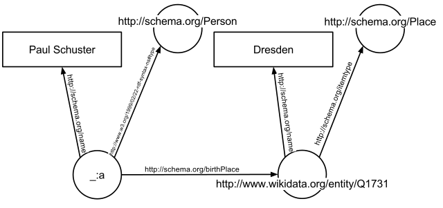

<header class="masthead">        
  <h1 class="masthead-title">
    <a href="{{ site.baseurl }}/">rdf4h RDF for Haskell</a>
  </h1>
  <!-- <nav class="masthead-nav"> -->
  <!--    -->
  <!--   <a href="{{ nav.href }}">{{ nav.name }}</a> -->
  <!--    -->
  <!-- </nav> -->
</header>

### Overview

The _rdf4h_ Haskell library is for querying structured data described
with the the __Resource Description Framework__ model, where data is a
collection of _<subject,predicate,object>_ triples:

    

        
    

     
    

        
     
    

     

### Rdf type class

The following `Rdf` type class methods are optimised for each graph implementation.


class Rdf a where
  baseUrl           :: RDF a -> Maybe BaseUrl
  prefixMappings    :: RDF a -> PrefixMappings
  addPrefixMappings :: RDF a -> PrefixMappings -> Bool -> RDF a
  empty             :: RDF a
  mkRdf             :: Triples -> Maybe BaseUrl -> PrefixMappings -> RDF a
  addTriple         :: RDF a -> Triple -> RDF a
  removeTriple      :: RDF a -> Triple -> RDF a
  triplesOf         :: RDF a -> Triples
  uniqTriplesOf     :: RDF a -> Triples
  select            :: RDF a -> NodeSelector -> NodeSelector -> NodeSelector -> Triples
  query             :: RDF a -> Maybe Node -> Maybe Node -> Maybe Node -> Triples
  showGraph         :: RDF a -> String


The `Data.RDF.Query` module contains more utility query functions,
[here](http://hackage.haskell.org/package/rdf4h-3.0.1/docs/Data-RDF-Query.html).

### Building RDF graphs interactively

An RDF graph can be constructed with `empty`, and its triples contents
modified with `addTriple` and `removeTriple`, e.g.:


{-# LANGUAGE OverloadedStrings #-}
module Main where
import Data.RDF

main :: IO ()
main = do
  -- empty list based RDF graph
  let myEmptyGraph = empty :: RDF TList

  -- add a triple to the empty graph
      triple1 = triple
        (unode "http://www.example.com/rob")
        (unode "http://xmlns.com/foaf/0.1/interest")
        (unode "http://dbpedia.org/resource/Scotch_whisky")
      graph1 = addTriple myEmptyGraph triple1

  -- add another triple to the graph
      triple2 = triple
        (unode "http://www.example.com/rob")
        (unode "http://xmlns.com/foaf/0.1/interest")
        (unode "http://dbpedia.org/resource/Haskell_(programming_language)")
      graph2 = addTriple graph1 triple2

  -- remove one of my interests
      graph3 = removeTriple graph2 triple1

  putStrLn (showGraph graph3)


### Bulk RDF graphs with parsing and writing

RDF graphs can also be populated by parsing RDF content from strings,
files or URLs:


class RdfParser p where
  parseString :: (Rdf a) => p -> T.Text -> Either ParseFailure (RDF a)
  parseFile   :: (Rdf a) => p -> String -> IO (Either ParseFailure (RDF a))
  parseURL    :: (Rdf a) => p -> String -> IO (Either ParseFailure (RDF a))


RDF graphs can also be serialised to handles with `hWriteRdf`:


class RdfSerializer s where
  hWriteRdf :: (Rdf a) => s -> Handle -> RDF a -> IO ()


E.g. to write an RDF graph to a file:


withFile "out.nt" WriteMode (\h -> hWriteRdf NTriplesSerializer h rdfGraph)


### Supported RDF serialisation formats

The rdf4h library supports three RDF serialisations:

| Serialisation        | Reading           | Writing  |
| ------------- |:-------------:|:-----:|
| NTriples     | &#10003; | &#10003; |
| Turtle      | &#10003;      | &#10003; |
| RDF/XML | &#10003;    | &#10007; |

### Type level RDF graph representations

The `RDF` type is a data family, for which there are a number of
instances. Those instances represent type level indexes that provide
the programmer with the choice of underlying in-memory graph
representation. 


data family RDF a

-- function provided a (s,p,o) triples based RDF graph.
foo :: RDF TList -> Bool
foo rdfGraph = ...

-- function provided a hash based adjacency map RDF graph.
bar :: RDF AdjHashMap -> [Triple]
bar rdfGraph = ...


 Those implementations
differ in their in-memory representation of RDF graphs.

* `RDF TList` stores triples as Haskell lists, i.e. `[(s,p,o),..]`.
  [The implementation](https://github.com/robstewart57/rdf4h/blob/master/src/Data/RDF/Graph/TList.hs).

* `RDF AdjHashMap` is an adjacency hash map with SPO and OPS indexes.
  [The implementation](https://github.com/robstewart57/rdf4h/blob/master/src/Data/RDF/Graph/AdjHashMap.hs).

#### TList implementation

Given two triples:


1 (s: "http://example.com/rob_stewart",
   p: "http://xmlns.com/foaf/0.1/interest",
   o: "http://dbpedia.org/resource/Semantic_Web")
2 (s: "http://example.com/rob_stewart",
   p: "http://xmlns.com/foaf/0.1/interest",
   o: "http://dbpedia.org/resource/Haskell_(programming_language)"


The `TList` implementation just stores them as is, i.e.


[ Triple (UNode "http://example.com/rob_stewart")
         (UNode "http://xmlns.com/foaf/0.1/interest")
         (UNode "http://dbpedia.org/resource/Semantic_Web")
, Triple (UNode "http://example.com/rob_stewart")
         (UNode "http://xmlns.com/foaf/0.1/interest")
         (UNode "http://dbpedia.org/resource/Haskell_(programming_language)")


#### AdjHashMap

The adjacency hash map implementation has two hash map implementations:

1. A hashed __S__ key pointing to value that is another hash map, whose key is a hashed __P__ pointing to a hash set of __O__ values.

2. A hashed __O__ key pointing to value that is another hash map, whose key is a hashed __P__ pointing to a hash set of __S__ values.

So our two-triple graph is stored in SPO and OPS indexes:


hash "http://example.com/rob_stewart"                             == -1527025807618695980
hash "http://xmlns.com/foaf/0.1/interest"                         == -2021146143382594279
hash "http://dbpedia.org/resource/Semantic_Web"                   == 3091419593178925190
hash "http://dbpedia.org/resource/Haskell_(programming_language)" == -8705743210846359529

-- SPO map
(k: -1527025807618695980
 v: (k: -2021146143382594279
     v: [3091419593178925190,-8705743210846359529]))

-- OPS map
(k: -8705743210846359529
 v: (k: -2021146143382594279
     v:[-1527025807618695980])
,
 k: 3091419593178925190
 v: (k: -2021146143382594279
     v:[-1527025807618695980]))


This makes querying `AdjHashMap` graphs with `query` very efficient,
but modifying the graph with `addTriple` and `removeTriple` more
expensive that the `TList` implementation, which just use `(:)` and
`filter` respectively.

The `TList` and `AdjHashMap` data family instances represent
application specific tradeoffs in terms of space and runtime
performance. `TList` performs better for `query`, whilst `AdjHashMap`
performs better for `select` and modifying triples in a graph with
`addTriple` and `removeTriple`. See
[these criterion results](http://robstewart57.github.io/rdf4h/rdf4h-bench-13112016.html)
for performance benchmarks, taken in November 2016.

### RDF query example


module Main where

import Data.RDF
import qualified Data.Text as T

eswcCommitteeURI, heldByProp :: T.Text
eswcCommitteeURI =
  "http://data.semanticweb.org/conference/eswc/2015/program-committee-member"
heldByProp       = "swc:heldBy"

-- full names of ESWC 2015 conference programme committee.
eswcCommitteeMembers :: RDF TList -> [T.Text]
eswcCommitteeMembers graph =
  let triples = query
                  graph
                  (Just (unode eswcCommitteeURI))
                  (Just (unode heldByProp))
                  Nothing
      memberURIs = map objectOf triples
  in map
     (\memberURI ->
              let (LNode (PlainL firstName)) =
                    objectOf $ head $
                      query
                        graph
                        (Just memberURI)
                        (Just (unode "foaf:firstName"))
                        Nothing
                  (LNode (PlainL lastName))  =
                    objectOf $ head $
                      query
                        graph
                        (Just memberURI)
                        (Just (unode "foaf:lastName"))
                        Nothing
              in (T.append firstName (T.append (T.pack  " ") lastName)))
     memberURIs
        
main :: IO ()
main = do
  result <- parseURL
    (XmlParser Nothing Nothing)
    "http://data.semanticweb.org/dumps/conferences/eswc-2015-complete.rdf"
  case result of
    Left err -> error "Unable to parse RDF content from that URL"
    Right rdfGraph -> do
      let eswcMemberNames = eswcCommitteeMembers rdfGraph
      mapM_ (putStrLn . T.unpack) eswcMemberNames


The list of the _Extended Semantic Web Conference 2015_ programme
committee members is printed to standard out:


> main
Vadim Ermolayev
Karl Aberer
Giorgos Stoilos
Birgitta König-Ries
Giuseppe Rizzo
...


[Here](https://gist.github.com/robstewart57/66eafe6d1eca54e9743e211d1fcd8c6e)
is an example of computing if the structure of two RDF graphs are
identical, using the hgal library.

### Tests

This library has two test suites:

1. Property based
   [tests](https://github.com/robstewart57/rdf4h/blob/master/testsuite/tests/Data/RDF/PropertyTests.hs)
   of the API using QuickCheck. All tests pass.
2. Unit [tests](https://github.com/w3c/rdf-tests/) provided by the W3C
   to test conformance of RDF parsers, of which there are
   currently 521. Some parsing tests fail currently.

To list the available tests that can be run in isolation using a
pattern:


$ stack test --test-arguments "--list-tests"


To run specific test groups:


$ stack test --test-arguments="--pattern TList"


### Please contribute!

Pull requests should be submitted to the rdf4h GitHub repository:
[https://github.com/robstewart57/rdf4h](https://github.com/robstewart57/rdf4h)

 

It'd be great to have:

- High performance RDF graph implementations
- Support for RDF quads, i.e. named RDF graphs
- Support for JSON RDF serialisation [ticket 34](https://github.com/robstewart57/rdf4h/issues/34)
- RDFS/OWL inference engines
- Parser performance improvements, e.g. [ticket 35](https://github.com/robstewart57/rdf4h/issues/35)
- Criterion profile guided API performance optimisations

In more detail...

 

#### High performance RDF graph implementations

__Wanted:__ new `Rdf` type class instances providing new high
performance RDF graph representations, beyond the three instances the
library currently has.

 

The latest set of criterion benchmark results (November 2016)
[are here](http://robstewart57.github.io/rdf4h/rdf4h-bench-13112016.html).
To run the criterion benchmarks locally:


$ wget https://www.govtrack.us/data/rdf/bills.099.actions.rdf.gz
$ gzip -d bills.099.actions.rdf.gz
$ stack bench


Or to run just the benchmarks for a specific RDF implementation, use
the `--benchmark-arguments` flag, e.g.:


$ stack bench --benchmark-arguments 'rdf4h/query/AdjHashMap'
...
Benchmark rdf4h-bench: RUNNING...
benchmarking rdf4h/query/AdjHashMap SPO
time                 506.4 ns   (505.0 ns .. 507.8 ns)
                     1.000 R²   (1.000 R² .. 1.000 R²)
mean                 505.8 ns   (504.4 ns .. 507.3 ns)
std dev              5.087 ns   (3.939 ns .. 6.874 ns)


 
